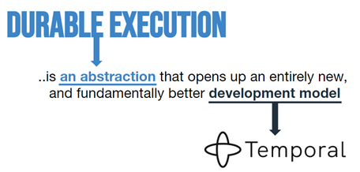

# temporal-release-orchestrator-demo-python
A release orchestration demo in python


# Temporal Idempotence By Validation Demo
This is a simple [Temporal](https://temporal.io/) demo in Python that orchestrates a release process, made up of one to many deploys, to one to many environments.

## Releasing is a Troublesome Process
A release is a complex process: orchestrating multiple failure-possible subprocesses, with possible human interaction and approval. Conceptually, you want to "do a release", which is often a series of manual steps:
1. Gather and document what is to be released, load it into the brains of the people doing the release
2. Verify that things are approved and good to go
3. For each thing to deploy in each environment we're releasing to:
    1. Do builds (if not build yet)
    2. Gather artifacts
    3. Gather configs
    4. Deploy artifacts
    5. Update configuration
    6. Verify deploy
4. Summarize Release success

**Output:** environmentsa are updated with new artifacts, and the process was successful and **well-understood**.

Manual deployment is often error-prone, as people aren't really great at doing the repetitive complex tasks perfectly over and over under pressure.

## Automation: Make the Robots Do It
All of these steps could be automated, and they often are at least partially automated.
Automation improves success rates, repeatability, and speed, but *reduces* visibility. If the automation fails it can be hard to figure out why or what happened vs. a manual process, assuming manual operators are perfect at validation and detecting their errors.

## Making The Process More Visible and Durable
[Temporal](https://temporal.io/)'s Durable Execution model adds two interesting pieces to a release & deploy process:
1. Insight
2. Durability

### Insight
Developing in the Temporal Workflow & Activity  model applies a natural organization to code:
**Workflow:** The orchestration goes here. Order and control goes here. The repeatable, deterministic process model goes here. Nothing that can break goes here.
**Activity:** The stuff that does stuff. Breakable steps go here. Should be idempotent. Can call other existing methods/services/functions.

Writing code in this model leads to a natural simplicity and understandability: you can follow the workflows as they execute in the Temporal UI:
(todo add screenshot here)

### Durability

This demo demonstrates the [durability](https://temporal.io/how-it-works) of a process implemented in Temporal:
1. Crashing the process doesn't kill it. Upon resume it picks up right where it left off.
2. Errors are recovered without thought or work
3. At-Least-Once execution: activities succeed at least once per the workflow

These capabilities are **great to develop with** and **change the way I think about doing development.** 



As a developer I can **focus** just on what I want to do, and Temporal manages what happens when things don't work out. 

While working on this project, I created **many** bugs in my activities, and all I had to do to fix my in-flight releases was fix the code bugs and restart the worker process. The  errors went away and none of the workflows failed, they all succeeded.

*Zero workflow processes failed in the building of this application*.


## Process Results
todo fill this out

The code in [starter](./starter/main.go) demonstrates the workflow. Initially, there are only a couple sample tickets in our "[database](./database/)". After ticket creation, you will see more created there.

Here is a sample ticket:

```json
{
    "orderID": "order-112358",
    "ticketID": "TICKET-42618",
    "paymentInfo": "VISA-5197-988-3381-2526"
}
```


# Getting Started
See [Setup Instructions](./setup.md).

### First Demo
After the setup is done, you can do the  basic demo described in the [setup instructions](./setup.md). 
You can see an order get processed, maybe fail randomly.


# Next Steps
1. Check out the ways to [demonstrate that this works nicely](./demos.md)
2. Play around with the code in new ways, try to break Temporal, maybe try some [retry policies](https://docs.temporal.io/retry-policies#:~:text=A%20Retry%20Policy%20works%20in,or%20an%20Activity%20Task%20Execution.) 
3. Feel free to fork and contribute!
