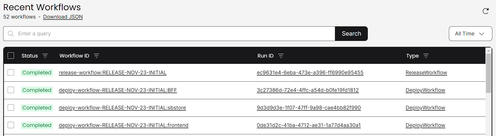
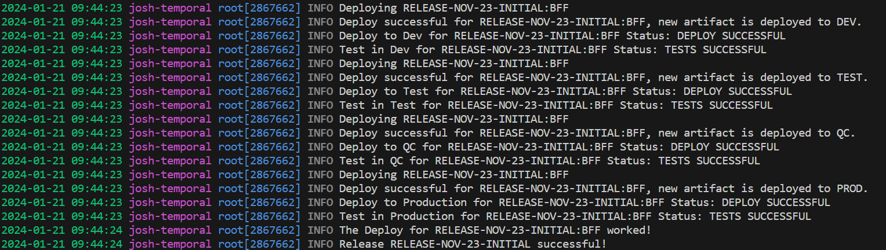

# Demos - Testing and Proving That Temporal Does What It Says
Playing with new frameworks is fun, and Temporal is a joy in particular because it can focus you to work on the core concepts and code, and ignore things not on the happy path.

## Simple Demo
This is the basic demo described in the [setup instructions](./setup.md). 
You can see a release being orchestrated.

Start the temporal server (or setup for cloud, see below):
```shell
temporal server start-dev
```
The Temporal Server will be available on localhost:7233.
The Temporal Web UI will be available at http://localhost:8233.

1. Run the worker:
```shell
python run_worker.py 
```

2. Run the workflow:
```shell
python run_workflow.py 
```

Navigate to the Temporal UI and see the release process:


You can also view the workflow requestor logs:
```shell
Result: Release RELEASE-NOV-23-INITIAL: SUCCESS
```
See the worker logs some interesting information:


Finally, you can see that the artifacts - just simple text files for the demo - are created in the folders as specified in the workflows and release process functions.

Even if the simulated errors happen, Temporal keeps executing the flow through to completion.

## Killing the Process Doesn't Make Anything Break
This demo shows that Temporal applications can survive process crashes. 

1. Run the worker:
```shell
python run_worker.py 
```

2. Run the workflow:
```shell
python run_workflow.py 
```

3. Wait until the workflow is going, and then kill the worker with CTRL+C
4. Observe that the workflow starter is happily waiting (since we tell it to synchronously wait), and the Temporal UI shows the workflow still alive
5. Start the worker again, and it will pick up where it left off and complete
6. Tada, your code is pretty bulletproof: the release flow completed, no steps were duplicated, and you didn't have to do anything besides use Temporal to make this happen.

## Errors, Errors Everywhere
1. Modify the various functions in the [release management system being orchestrated](./release_management.py) with different error options from [utils.py](./utils.py) to have a higher likelihood of error by changing them to use, for example, isErrorALot():
```python
def isErrorALot() -> bool:
    if random.randint(1, 10) > 4 :
        return True
    
    return False
```
see for example from gather_deployments():
```python
    # throw an error here sometimes
    if utils.isErrorRarely() :
         raise RuntimeError(f"Release Exception: At end of gathering releases for {release_info.release_key} failed!")
```

2. Run the worker:
```shell
python run_worker.py 
```

3. Run the workflow:
```shell
python run_workflow.py 
```

4. Observe that the workflow starter is happily waiting (since we tell it to synchronously wait), and the Temporal UI shows the workflow still alive
5. Observe that despite warnings about activities failing, they are retried and eventually succeed.
6. Tada, your code is pretty bulletproof: the release flow completed, no steps were duplicated, and you didn't have to do anything besides use Temporal to make this happen.

## Orchestrate Multiple Releases
In [utils.py](./run_workflow.py), try going through the releases and note that the artifacts in the environments change and different versions are deployed to different environments. Change the Release Key to "RELEASE-NOV-23-HOTFIX-STAGE", then "RELEASE-DEC-2023-BUGFIXES-PROD", and so on:
```python
    releasekey = "RELEASE-NOV-23-INITIAL" # everything to 1.0
    #releasekey = "RELEASE-NOV-23-HOTFIX-STAGE" # new versions to everything but PROD
    #releasekey = "RELEASE-DEC-2023-BUGFIXES-PROD" # new versions to PROD
    #releasekey = "RELEASE-JAN-24-ALPHA-DEV" # January release to DEV
    #releasekey = "RELEASE-JAN-24-ALPHA-QC" # January release to TEST, QC
    #releasekey = "RELEASE-JAN-24-ALPHA-PROD" # January release to PROD
```

To reset it, you can just release "RELEASE-NOV-23-INITIAL" again. The artifacts will still be in "artifactory". You can also just delete the files and they will be "built" and "deployed" when you run the initial release.

## Build a Release Management System
If you want to turn this into a real application, take a look at the todo.md


